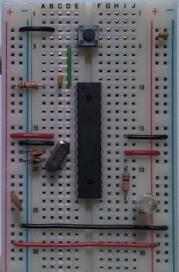

:::caution[En fin de TP...]
10 minutes seront consacrés pour ranger les composants.
:::

## Préparation 

Il vous faut :

- Une [platine d'expérimentation](https://fr.wikipedia.org/wiki/Platine_d%27exp%C3%A9rimentation).
- Des câbles de connexion (à fabriquer si besoin).
- Les composants des schémas à réaliser.

En option :

- Fer à souder, étain, pompe (pour fabriquer des câbles).

L'alimentation sera fournie par l'enseignant une fois les circuits réalisés.

## 1. LED et résistance en série

:::note
- Ce schéma ne nécessite pas de câble.
- Trouvez par vous-même la valeur de la résistance.
- Utilisez une feuille de papier pour faire le schéma.
:::

Mettez une LED rouge en série avec une résistance correctement dimensionnée.

- Tension d'alimentation : 9V
- Tension de la led : 1,7V
- Courant de la LED : 10mA

## 2. LED clignotante

L'objectif est de réaliser [le schéma suivant](https://www.positron-libre.com/electronique/led/led-clignotant-unijonction.php) qui comporte de nouveaux composants.

- Un condensateur.
- Un transistor unijonction.
- Des résistances de différentes valeurs.

Faire vérifier le schéma à votre enseignant avant de le mettre sous tension.

## 3. Métronome

On peut fabriquer un métronome avec un schéma simple autour d'un NE555. L'objectif est de réaliser [ce schéma](https://www.positron-libre.com/electronique/ne555/metronome.php).

- Utilisez un [support pour circuit intégré](https://www.gotronic.fr/media/cache//app_shop_taxon_show_bann/4e/18/e0181d46877f67bcce9e6909e1d1.jpg.webp).
- Aidez-vous du [brochage du NE555](https://fr.wikipedia.org/wiki/NE555#Brochage).
- Respectez bien les valeurs des composants.

## Souder des câbles (option)

:::caution
- Merci de **ne pas couper de câbles mâle-mâle** que nous avons en nombre limité.
- Disposez vos composants de manière à utiliser **le moins de câbles possible**.
:::

:::danger
La soudure est une opération dangereuse, le fer à souder peut occasionner des blessures.

- **Manipulez le fer avec précaution**
- **Eteignez-le quand vous ne l'utilisez pas**
:::

Avoir des jonctions courtes permet d'avoir un résultat plus lisible et d'économiser du câble.

Pour créer un câble :

- Couper à la bonne dimension (légèrement + grand).
- Dénuder soigneusement (éviter de couper des brins).
- Torsader soigneusement (il faut que ce soit bien droit).
- Etamez avec le fer et un peu d'étain.
- Retirez le surplus avec la pompe à désouder.
- Coupez légèrement l'extrémité de la partie étamée.
