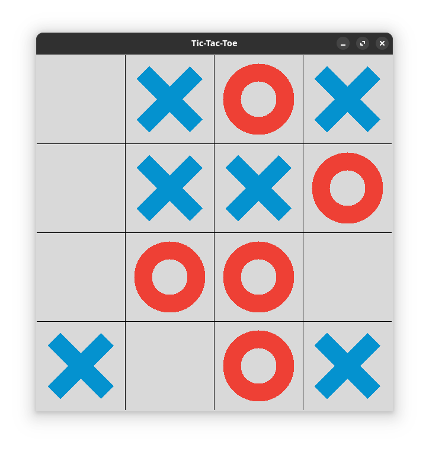

## Préparation

Créer un dossier "`algo-python`" dans lequel tu mettras les fichiers de ton TP. Dans ce dossier, crée un fichier "`reponses.md`" dans lequel tu répondras aux questions. Ce fichier doit contenir le squelette suivant&nbsp;:

```markdown
# Réponses aux questions d'algorithmique

## Exercice 1

- 1.1 : écrire ici la réponse à la question 1.1
- 1.2 : écrire ici la réponse à la question 1.2
- etc.

## Exercice 2

- 2.1 : ...
- 2.2 : ...
- ...

## ...
```

## Notation

- Pour chaque exercice le nombre de points est indiqué.
- Parfois il y a des bonus.
- La note est plafonnée à 20.

:::caution[Quelques règles]
- Les IAs (chatgpt, etc.) sont interdites.
- Copier-coller du code depuis internet est interdit.
- Tutoriaux et manuels python sont autorisés.
:::

:::danger[Rendu avec GIT]
Crée un dépôt `algo-python` avec ton compte, tel que nous l'avons déjà fait [ici](/informatique/travaux-pratiques/06-pygame/#01-création-du-dépôt-git). On validera à chaque fin d'exercice.
:::

## Exercice 1 (2 points)

Voici un algorithme :

```
x ← 0
y ← -1
si x > y alors
  x ← x+y
sinon
  y ← x-y
afficher x et y
```

Et voici le code python correspondant :

```python
x = 0
y = -1

if x > y :
  x = x+y
else : 
  y = x-y

print(x,y)
```

- 1.1 : D'après l'algorithme, on va passer dans "`si`" ou dans "`sinon`" ?
- 1.2 : Exécuter le code python. Quel est son résultat ?
- 1.3 : Changer les valeurs en "`x = -3`" et "`y = -1`". Quel est le résultat ?
- 1.4 : Avec ces nouvelles valeurs, on passe dans "`if`" ou dans "`else`" ?

:::danger[Validation GIT]
Ajoute et valide tes sources :

```sh
git add .
git commit -m "Exercice 1"
git push
```
:::

## Exercice 2 (2 points)

Voici un algorithme :

```
a ← 24 
b ← 12
c ← -4 
d ← a+b+c 
Afficher(d)
```

Dans un fichier "`2.py`", écrire le code python correspondant à cet algorithme.

Puis remplacer la première affectation par le code suivant :

```python
a = float(input("Entrer la valeur de a: "))
```

- 2.1 : Exécuter ce code et entrer "`12`" comme valeur pour "`a`". Qu'est-ce qui est précisément affiché à l'écran ?

:::danger[Validation GIT]
Ajoute et valide tes sources :

```sh
git add .
git commit -m "Exercice 2"
git push
```
:::

## Exercice 3 (3 points)

On considère maintenant cet algorithme :

```
saisir(a)
saisir(b)
si a < b alors
	c ← b+2a
sinon 
	c ← a-2b 
afficher(c)
```

- 3.1 : Si a=1 et b=-2, on passe par "`si`" ou "`sinon`" ?
- 3.2 : Si a=-3 et b=4, on passe par "`si`" ou "`sinon`" ?

Dans un fichier "`3.py`", écrire le code python correspondant.


:::danger[Validation GIT]
Ajoute et valide tes sources :

```sh
git add .
git commit -m "Exercice 3"
git push
```
:::

## Exercice 4 (5 points)

Voici le "jeu du juste prix" en Python :

```python
# On importe la bibliothèque "random" qui permet de 
# générer des nombres aléatoires
import random

# On crée une fonction "jeu du juste prix"
def jeu_du_juste_prix():
    print("Bienvenue dans le jeu du Juste Prix !")
    print("J'ai choisi un nombre entre 1 et 100. À toi de deviner !")

    # On génère un nombre aléatoire avec la bibliothèque "random"
    nombre_a_deviner = random.randint(1, 100)

    # Cette variable contient le nombre d'essais
    essais = 0

    # Tant que le joueur n'a pas trouvé...
    while True:

        # On lui demande de saisir une valeur
        essai = int(input("Entre ta proposition : "))
        essais += 1
        
        # On compare avec le nombre à deviner et affiche le résultat
        if essai < nombre_a_deviner:
            print("Le nombre à deviner est plus grand.")
        elif essai > nombre_a_deviner:
            print("Le nombre à deviner est plus petit.")
        else:
            print(f"Bravo ! Tu as trouvé en {essais} essais.")
            break # Si on a trouvé, on sort de la boucle "while"
    
    # Fin du jeu
    print("Merci d'avoir joué ! À bientôt.")

# Appel de la fonction
jeu_du_juste_prix();
```

Dans un fichier "`4.py`", écrire ce code (sans les commentaires), puis l'exécuter.

- 4.1 : Comment s'appelle la fonction déclarée dans ce code ?
- 4.2 : Comment fonctionne la boucle "`while`" et comment on en sort ?
- 4.3 : Dans "`essai = int(input("Entrez votre proposition : "))`", à quoi sert "`int`" à ton avis ?

Enfin, ajouter le code permettant de demander au joueur s'il veut rejouer à la fin de la partie.

:::danger[Validation GIT]
Ajoute et valide tes sources :

```sh
git add .
git commit -m "Exercice 4"
git push
```
:::

## Exercice 5 (7 points : 3 + 4)

Dans cet exercice, on va apprendre à modifier un code python existant, par exemple ici avec un jeu de morpion.

- Cloner ou télécharger `https://github.com/aqeelanwar/Tic-Tac-Toe`.
- Exécuter le code.
- Modifier le code pour :
  - Inverser la couleur du "`X`" et du "`O`".
  - Traduire tous les textes en français.
  - Changer la taille des textes pour qu'ils soient plus petits.

On va maintenant tenter de modifier le plateau du jeu :

- Il doit avoir 4 lignes et 4 colonnes (cf. image).
  - Dessiner 4x4 cases et réduire la taille des "X" et des "O".
- On gagne si on aligne 3 "X" ou 3 "O" (et non 4).
  - Attention il faut envisager tous les cas de figure !



:::danger[Validation GIT]
Ajoute et valide tes sources :

```sh
git add .
git commit -m "Exercice 5"
git push
```
:::